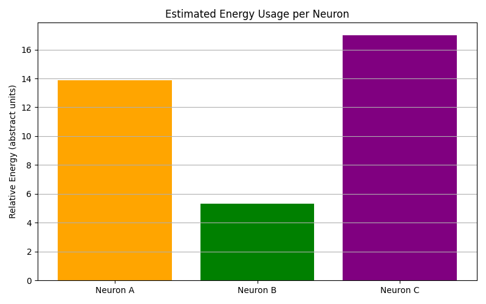

# HaNDS: A Habituation-Driven Neuromorphic Anomaly Detection System

HaNDS is a biologically inspired anomaly detection framework that simulates habituating neurons to detect novel or surprising events in time-series signals.

This implementation targets ECG anomaly detection using the ECG5000 dataset, and compares the HaNDS framework against traditional statistical and ML-based anomaly detectors.

## Motivation

While most anomaly detection methods rely on statistical deviations or trained models, biological neurons use a more adaptive process called habituation, where repeated exposure to the same stimulus weakens response, and novel input triggers a spike.

This project simulates that behavior with a lightweight model in C++, tracks neuron dynamics across sequences, and evaluates novelty using entropy and energy analysis.

## Algorithm Overview

Each neuron behaves as follows:
- If stimulus is present, its response decays at a rate $\beta$.
- If stimulus is absent, the response recovers at a rate $\alpha$.
- A novelty spike is triggered if response drops below a threshold $\theta$.

The stimulus itself is adaptive:  
Each ECG signal is analyzed to compute a threshold:

$$
\text{Adaptive Threshold} = \mu + 0.5 \times \sigma
$$

Stimulus is set to $$1$$ if ECG value exceeds this adaptive threshold.

## Dataset Used

ECG5000 dataset (from UCR archive):  
- Contains 5000 ECG sequences  
- Length: 140 timesteps each  
- Label 1 = normal  
- Labels 2 to 5 = anomalous  

## How to Run

### Step 1: Run the Model

Make sure you have a C++17 compatible compiler (e.g., g++, clang++).

To compile and run the HaNDS model, you can either:

**Option 1: Use the provided Makefile**

    make
    ./hands

**Option 2: Compile manually**

    g++ main.cpp habituating_neuron.cpp -o hands
    ./hands

This will read the ECG5000 dataset, run all three habituating neurons on each sequence, and save the output to:

    results/ecg_multi_neuron_output.csv

### Step 2: Generate Plots

Each result image is generated by running its corresponding Python script inside the `plots/` folder.
Run them one by one:

    python plots/01_multineuron_response.py
    python plots/02_entropy_scores.py
    python plots/03_response_vs_novelty_curve.py
    python plots/04_baseline_comparison.py
    python plots/05_energy_estimation.py

This will generate the corresponding PNG images inside the same `plots/` directory.

## Results and Visualizations

### 1. Multi-Neuron Novelty Detection  
Each line is a neuron with different sensitivity. Novelty is marked in color-coded shapes.

### 2. Individual Neuron Response Curves  
Each neuron’s decay profile and novelty spikes over time.

### 3. Comparison with Classical and ML Baselines  
Includes Z-score, MAD, Slope, Isolation Forest, One-Class SVM.  
HaNDS detects novelty only where it matters.

### 4. Energy Usage per Neuron  
Measures total activity: internal decay plus novelty spikes.

### 5. Entropy (Surprise Level) of Novelty Triggers

Each neuron's firing pattern was binarized and entropy was calculated.

    Entropy Scores for Sequence 0:
    Neuron A: 0.9006 bits
    Neuron B: 0.3731 bits
    Neuron C: 0.9684 bits

## Assumptions

This project makes the following key assumptions, based on simplicity, biological plausibility, and empirical tuning:

### 1. Stimulus Threshold:

Instead of using a fixed value, the stimulus threshold is adaptively computed for each sequence using:

$$
\text{Adaptive Threshold} = \mu + 0.5 \times \sigma
$$

This captures the signal's statistical context. The factor $0.5$ was chosen to balance sensitivity and robustness:  
- Higher multipliers (e.g., $1.0$) caused neurons to ignore moderate spikes.  
- Lower values (e.g., $< 0.3$) led to overstimulation and reduced novelty.

---

### 2. Neuron Parameters $(\alpha, \beta, \theta)$

Three neurons were configured with differing sensitivity and decay/recovery behavior:

- **Neuron A**: $(\alpha = 0.05, \beta = 0.2, \theta = 0.3)$ – balanced  
- **Neuron B**: $(\alpha = 0.03, \beta = 0.1, \theta = 0.25)$ – slow to habituate, energy efficient  
- **Neuron C**: $(\alpha = 0.07, \beta = 0.3, \theta = 0.4)$ – rapid decay, highly sensitive

These were chosen to demonstrate how different "neurons" could specialize in distinct novelty patterns, mimicking diversity in biological neural systems.

---

### 3. Energy Estimation and Spike Cost

Total neuron energy is estimated as:

$$
\text{Energy} += \left| r_t - r_{t-1} \right| + 
\begin{cases}
\text{Spike Cost}, & \text{if novelty is triggered} \\\\
0, & \text{otherwise}
\end{cases}
$$

Where $r_t$ is the response at timestep $t$.

- The internal effort term reflects how much the neuron's state changes over time.
- A fixed spike cost of $0.5$ is used to account for the energy burden of firing.

This cost is not biologically precise but is sufficient to reflect a trade-off between sensitivity and efficiency across different neurons.

---

These assumptions were validated through visual inspection, entropy and energy analysis, and comparison with classical detection baselines.

## Interpretation

- Neuron A: Balanced novelty detection  
- Neuron B: Sparse firing, low entropy, low energy (efficient)  
- Neuron C: High sensitivity, fires early and often  

HaNDS provides diverse novelty profiles which are useful for adaptive detection in real systems.

## Key Takeaways

- HaNDS mimics biological habituation for novelty detection
- Uses adaptive thresholds to model contextual surprise
- Achieves efficient, interpretable detection without ML
- Shows strong performance versus traditional outlier methods

## Future Work

- Apply to sensor data, network traffic, or financial time-series
- Extend to multi-class novelty by combining neuron outputs
- Explore spiking neuron hardware compatibility

## Author

- Developed by Siddhartha Pundit
- Feel free to fork or contribute.